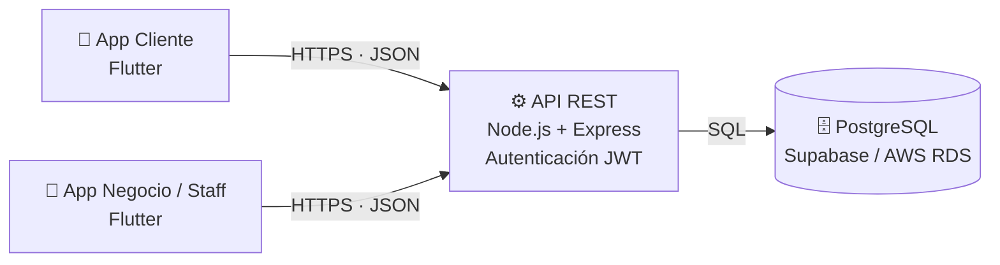
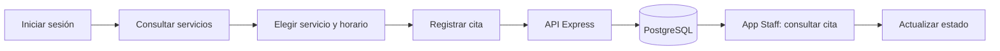

<div align="center">

# 🌸 Aura Spa

### Gestión de citas para los servicios de un spa

Aplicaciones móviles para **clientes** y **personal del negocio**, conectadas a una API propia y a una base de datos relacional.


**Universidad de Colima** · Proyecto Integrador · Fase II: prototipo funcional

</div>

---

## 📖 ¿De qué trata?

**Aura Spa** resuelve un problema común en los spas: agendar y administrar citas sin llamadas ni mensajes sueltos.

- El **cliente** explora los servicios, ve sus detalles y reservas su cita desde el celular.
- El **personal del negocio** consulta las citas recibidas, gestiona los servicios y actualiza el estado de cada cita.

Todo pasa por una API central que guarda la información en PostgreSQL.

## ✨ Funcionalidades

### 📱 App Cliente
- 👀 **Modo invitado:** se puede explorar el catálogo sin crear cuenta.
- 🔎 **Catálogo de servicios** con buscador y filtro por categoría (Facial, Corporal, Manicure, Aromaterapia y Pedicure).
- 📄 **Detalle del servicio** con duración, precio y calificación.
- 🔐 **Acceso unificado por correo:** el sistema detecta si ya tienes cuenta. Si existe, pide la contraseña; si no, te lleva a registrarte.
- ✅ **Registro con verificación** por código de 6 dígitos.
- 👤 **Perfil** y **Mis citas**, disponibles al iniciar sesión.
- 📅 **Reserva de citas**.

### 🧑‍💼 App Negocio / Staff
- Inicio de sesión del personal.
- Consulta de citas y de servicios.
- Alta y edición de servicios.
- Actualización del estado de las citas.

## 🏗️ Arquitectura

Dos aplicaciones Flutter independientes comparten el mismo backend y la misma base de datos.



### 🔄 Flujo principal de la demostración



## 🗃️ Modelo de datos

La base de datos relacional incluye, entre otras, estas entidades:

| Entidad | Para qué sirve |
|---|---|
| `usuarios` | Cuenta de acceso: correo, contraseña, rol y estado |
| `clientes` | Datos personales de quien reserva |
| `empleados`, `puestos`, `horarios` | Personal del spa y su disponibilidad |
| `categorias`, `servicios` | Catálogo de servicios |
| `empleado_servicios` | Qué empleado realiza qué servicio |
| `citas` | Reservas, con la duración y el precio aplicados |
| `resenas` | Calificaciones del servicio y del empleado |
| `favoritos_servicios`, `favoritos_empleados` | Preferencias del cliente |
| `notificaciones` | Avisos relacionados con las citas |

## 🛠️ Tecnologías

| Componente | Tecnología |
|---|---|
| Diseño de interfaces | Figma |
| Apps móviles | Flutter + Dart (Android Studio) |
| Backend | Node.js + Express |
| Base de datos | PostgreSQL remoto (Supabase o AWS RDS) |
| Control de versiones | Git + GitHub |

## 👥 Equipo

| Integrante | Responsabilidad |
|---|---|
| **Génesis** | Líder del proyecto, coordinación e integración |
| **Kevin** | Frontend de la App Cliente |
| **Zinedine** | Frontend de la App Negocio/Staff y QA |
| **Vanessa** | Backend: API Express, autenticación y lógica |
| **Mario** | Administración de la base de datos PostgreSQL |
| **Máximo** | UX/UI, pruebas y documentación |

## 🗺️ Avance

| Fase | Estado |
|---|---|
| Fase I: análisis y diseño (casos de uso, mockups y modelo de datos) | ✅ Completada |
| Fase II: prototipo funcional (29 sep – 7 oct 2026) | 🔄 En curso |
| Fase III: funciones ampliadas y cierre | ⏳ Pendiente |

## 🚀 Cómo ejecutar la App Cliente

> El código se integra a `main` al cierre de cada fase. Mientras tanto, cada integrante trabaja en su propia rama; la App Cliente está en la rama `KEVIN`.

**Requisitos:** [Flutter](https://docs.flutter.dev/install) instalado, Android Studio y un emulador o un celular Android con depuración USB.

```bash
git clone https://github.com/GenesisCampos100/APP_MOVIL_SPA.git
cd APP_MOVIL_SPA
git checkout KEVIN
cd app_cliente
flutter pub get
flutter run
```

**Datos de prueba** (mientras la app no esté conectada a la API):

| Qué probar | Datos |
|---|---|
| Cuenta ya registrada | `cliente@aura.com` · contraseña `Aura1234` |
| Cuenta nueva | cualquier otro correo; el código de verificación es `123456` |

## 📁 Estructura del repositorio

```
APP_MOVIL_SPA/
├── app_cliente/     App móvil del cliente (Flutter)
│   ├── lib/
│   │   ├── core/        tema y navegación
│   │   ├── data/        modelos y repositorios
│   │   ├── features/    pantallas por módulo
│   │   └── shared/      componentes reutilizables
│   └── assets/      imágenes
└── README.md
```

Las carpetas de la App Negocio/Staff y del backend se agregarán al integrarse cada parte.

<!--
📸 CAPTURAS (activar cuando haya imágenes):
1. Crea la carpeta docs/capturas y sube tus imágenes (por ejemplo inicio.png, catalogo.png, acceso.png).
2. Quita las marcas de comentario de este bloque y ajusta los nombres.

## 📸 Capturas

| Inicio | Catálogo | Acceso |
|:---:|:---:|:---:|
|  |  |  |
-->

---

<div align="center">

Hecho con 💗 por el equipo de **Aura Spa** · Universidad de Colima · 2026

</div>
